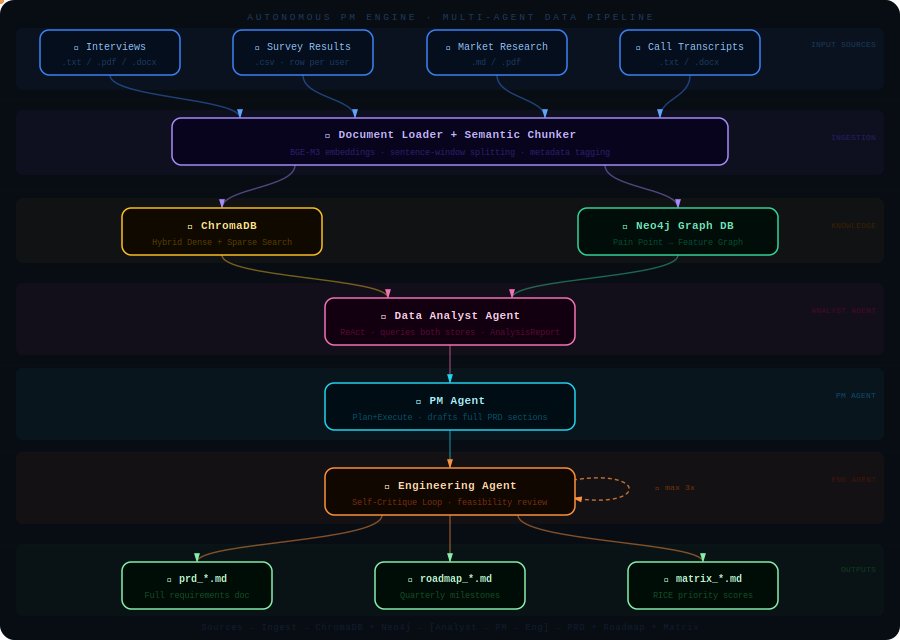

# Autonomous Product Management Engine

> A production-grade, multi-agent system that ingests unstructured customer feedback, surfaces quantitative trends, and automatically generates structured Product Requirement Documents (PRDs) and engineering roadmaps.

---

## How It Works
 

 
> **Reading the diagram:** Coloured dots flow live through each connection showing data in motion. Blue dots carry raw documents into the ingestion layer; violet splits them into ChromaDB (dense+sparse search) and Neo4j (entity graph); amber and emerald query results converge into the Data Analyst Agent; pink and cyan carry the structured report through the PM Agent and into the Engineering Agent, where the dashed loop shows the self-critique cycle; orange fans out to the three final output files.
 
---

## Architecture Overview

```
┌─────────────────────────────────────────────────────────────────────┐
│                         INPUT LAYER                                 │
│  Customer Interviews │ Survey CSVs │ Market Research Docs │ PDFs    │
└───────────────────────────────┬─────────────────────────────────────┘
                                │
                                ▼
┌─────────────────────────────────────────────────────────────────────┐
│                     LAYER 5 — KNOWLEDGE LAYER                       │
│                                                                     │
│  ┌──────────────────┐    ┌────────────────────┐    ┌──────────────┐ │
│  │  Document Loader │───▶│  Semantic Chunker   │───▶│  Embeddings  ││
│  │  (multi-format)  │    │  (sentence-window)  │    │  (BGE-M3)    ││
│  └──────────────────┘    └────────────────────┘    └──────┬───────┘ │
│                                                           │         │
│                          ┌─────────────────┐              │         │
│                          │    Graph DB      │◀─── Entity  │         │
│                          │    (Neo4j)       │     Linking │         │
│                          │  Pain→Feature    │             │         │
│                          └─────────────────┘              │         │
│                                                           ▼         │
│                          ┌─────────────────────────────────────────┐│
│                          │        Vector DB (ChromaDB)             │|
│                          │   Hybrid Search: Dense + Sparse (BM25)  ││
│                          └─────────────────────────────────────────┘│
└───────────────────────────────┬─────────────────────────────────────┘
                                │
                                ▼
┌─────────────────────────────────────────────────────────────────────┐
│                   LAYER 4 — ORCHESTRATION LAYER (LangGraph)         │
│                                                                     │
│   INGEST ──▶ EMBED ──▶ EXTRACT_ENTITIES ──▶ ANALYZE ──▶ DRAFT_PRD   │
│                                                              │      │
│   ◀──────────────── REVIEW_PRD (self-critique loop) ◀───────┘       │
│         │                                                           │
│         ▼ (passes gate)                                             │
│       OUTPUT                                                        │
└───────────────────────────────┬─────────────────────────────────────┘
                                │
                                ▼
┌─────────────────────────────────────────────────────────────────────┐
│                       AGENT LAYER (CrewAI)                          │
│                                                                     │
│  ┌─────────────────┐  ┌────────────────┐  ┌─────────────────────┐   │
│  │  Data Analyst   │  │   PM Agent     │  │  Engineering Agent  │   │
│  │  Agent          │  │  Plan+Execute  │  │  ReAct + Self-Crit. │   │
│  │  (trends/stats) │  │  (PRD draft)   │  │  (feasibility gate) │   │
│  └─────────────────┘  └────────────────┘  └─────────────────────┘   │
└───────────────────────────────┬─────────────────────────────────────┘
                                │
                                ▼
┌─────────────────────────────────────────────────────────────────────┐
│                         OUTPUT LAYER                                │
│     PRD Markdown  │  Engineering Roadmap  │  Feature Priority Matrix│
└─────────────────────────────────────────────────────────────────────┘
```

---

## Tech Stack

| Layer | Technology | Purpose |
|---|---|---|
| LLM | OpenAI GPT-4o | Reasoning backbone for all agents |
| Embeddings | `BAAI/bge-m3` (sentence-transformers) | Dense semantic embeddings |
| Vector DB | ChromaDB | Hybrid dense + sparse retrieval |
| Graph DB | Neo4j | Entity linking: pain points to features |
| Agent Framework | CrewAI | Role-based multi-agent execution |
| Orchestration | LangGraph | Stateful, cyclical workflow DAG |
| Document Loading | LangChain community loaders | PDF, DOCX, CSV, TXT ingestion |
| API (optional) | FastAPI | REST interface for pipeline |
| Config | Pydantic Settings | Type-safe environment management |
| Observability | Loguru + Rich | Structured logging and console output |

---

## Prerequisites

- Python 3.11+
- Docker and Docker Compose (for Neo4j + ChromaDB server mode)
- An OpenAI API key (GPT-4o access required)

---

## Quick Start

### 1. Clone and install

```bash
git clone https://github.com/Agent007repo/autonomous-pm-engine.git
cd autonomous-pm-engine

python -m venv .venv
source .venv/bin/activate          # Windows: .venv\Scripts\activate

pip install -r requirements.txt
```

### 2. Configure environment

```bash
cp .env.example .env
# Edit .env and fill in your OpenAI API key and Neo4j credentials
```

### 3. Start infrastructure services

```bash
docker-compose up -d
# Starts Neo4j (bolt://localhost:7687) and waits for readiness
```

### 4. Run the pipeline on sample data

```bash
python main.py --input-dir sample_data/ --output-dir outputs/
```

### 5. View outputs

The pipeline writes three files to `outputs/`:

```
outputs/
├── prd_<timestamp>.md          # Full structured PRD
├── roadmap_<timestamp>.md      # Engineering roadmap (quarters)
└── priority_matrix_<timestamp>.md  # Feature priority matrix (RICE)
```

---

## Running via API

```bash
uvicorn api:app --reload --port 8000
```

Then POST your documents:

```bash
curl -X POST http://localhost:8000/analyze \
  -F "files=@sample_data/customer_interviews.txt" \
  -F "files=@sample_data/survey_results.csv" \
  -F "product_name=MyProduct" \
  -F "product_context=B2B SaaS project management tool"
```

---

## Project Structure

```
autonomous-pm-engine/
├── main.py                        # CLI entry point
├── api.py                         # FastAPI REST interface
├── requirements.txt
├── docker-compose.yml
├── .env.example
├── src/
│   ├── config/
│   │   └── settings.py            # Pydantic settings (all env vars)
│   ├── knowledge/
│   │   ├── document_loader.py     # Multi-format document ingestion
│   │   ├── semantic_chunker.py    # Sentence-window semantic chunking
│   │   ├── vector_store.py        # ChromaDB hybrid search wrapper
│   │   └── graph_store.py         # Neo4j entity-linking operations
│   ├── agents/
│   │   ├── data_analyst_agent.py  # CrewAI: trend analysis
│   │   ├── pm_agent.py            # CrewAI: PRD drafting (plan+execute)
│   │   └── engineering_agent.py   # CrewAI: feasibility + self-critique
│   ├── orchestration/
│   │   ├── state.py               # LangGraph TypedDict state schema
│   │   ├── nodes.py               # Individual graph node functions
│   │   └── workflow.py            # StateGraph assembly + compilation
│   ├── tools/
│   │   ├── search_tools.py        # LangChain tools (vector + graph)
│   │   └── output_tools.py        # PRD section writing tools
│   └── output/
│       ├── prd_generator.py       # PRD assembly logic
│       └── templates.py           # Markdown templates
├── sample_data/
│   ├── customer_interviews.txt
│   ├── survey_results.csv
│   └── market_research.md
├── outputs/                       # Generated PRDs land here
├── tests/
│   ├── test_chunker.py
│   ├── test_vector_store.py
│   ├── test_graph_store.py
│   └── test_workflow.py
└── docs/
    ├── architecture.md            # Deep-dive design decisions
    └── extending.md               # How to add new agents/data sources
```

---

## Configuration Reference

All configuration lives in `.env`. See `.env.example` for the full list.

| Variable | Default | Description |
|---|---|---|
| `OPENAI_API_KEY` | required | OpenAI API key |
| `OPENAI_MODEL` | `gpt-4o` | Model used by all agents |
| `NEO4J_URI` | `bolt://localhost:7687` | Neo4j connection URI |
| `NEO4J_USER` | `neo4j` | Neo4j username |
| `NEO4J_PASSWORD` | required | Neo4j password |
| `CHROMA_HOST` | `localhost` | ChromaDB host |
| `CHROMA_PORT` | `8001` | ChromaDB HTTP port |
| `CHROMA_COLLECTION` | `pm_engine` | Collection name |
| `EMBEDDING_MODEL` | `BAAI/bge-m3` | sentence-transformers model |
| `CHUNK_SIZE` | `512` | Max tokens per semantic chunk |
| `CHUNK_OVERLAP` | `64` | Token overlap between chunks |
| `TOP_K_RETRIEVAL` | `10` | Chunks retrieved per query |
| `MAX_CRITIQUE_ROUNDS` | `3` | Engineering self-critique iterations |
| `LOG_LEVEL` | `INFO` | Loguru log level |

---

## Agent Roles

### Data Analyst Agent
- Queries ChromaDB for top recurring pain-point themes
- Queries Neo4j for feature frequency and co-occurrence graphs
- Outputs a structured `AnalysisReport` with quantified trends

### PM Agent (Plan-and-Execute)
- Receives `AnalysisReport` and creates a step-by-step PRD plan
- Executes each PRD section (Overview, Goals, User Stories, Acceptance Criteria, Non-Goals)
- Uses the vector store as a retrieval tool to ground claims in source data

### Engineering Agent (ReAct + Self-Critique)
- Reads the drafted PRD
- Identifies technical feasibility risks, missing NFRs, and under-specified acceptance criteria
- Runs up to `MAX_CRITIQUE_ROUNDS` self-critique loops until a quality gate passes
- Appends a "Technical Feasibility Assessment" section to the final PRD

---

## Sample Output Structure (PRD)

```markdown
# PRD: [Feature Name]
**Version:** 1.0 | **Status:** Draft | **Generated:** YYYY-MM-DD

## 1. Executive Summary
## 2. Problem Statement (grounded in customer data)
## 3. Goals and Success Metrics (OKR format)
## 4. User Stories (Gherkin format)
## 5. Acceptance Criteria
## 6. Non-Goals and Out of Scope
## 7. Technical Feasibility Assessment (Engineering Agent)
## 8. Engineering Roadmap (quarterly milestones)
## 9. Feature Priority Matrix (RICE scoring)
## 10. Open Questions and Risks
## 11. Source Evidence (citations from ingested data)
```

---

## Running Tests

```bash
pytest tests/ -v
```

---

## Contributing

See `docs/extending.md` for instructions on adding new:
- Document loaders (e.g., Notion, Jira export)
- Agent roles (e.g., UX Researcher Agent)
- Output formats (e.g., Confluence export, Linear integration)

---

## License

MIT
