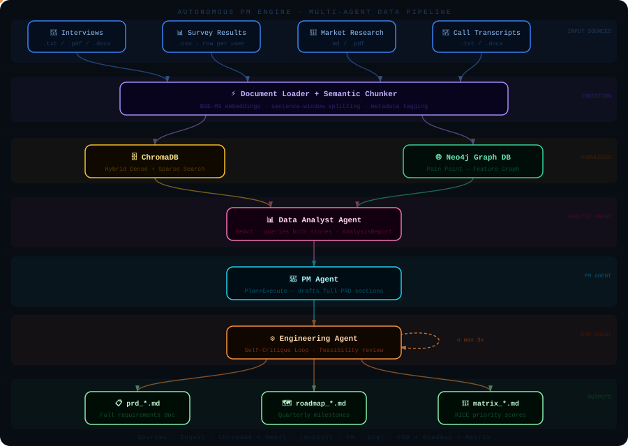

# Autonomous Product Management Engine

Production-style AI product prototype that turns unstructured customer feedback into product requirements, roadmap recommendations, and feature prioritization artifacts.

## Project Maturity

This is an advanced prototype, not a production SaaS service. It is designed to demonstrate AI product architecture, retrieval workflows, agent orchestration, and product-management automation. The current repository uses a flat Python module layout; the README and setup instructions are now written to match that public structure.

## Problem

Product teams spend a large amount of time turning interviews, survey data, market notes, and support feedback into structured PRDs. The hard part is not writing a document; it is synthesizing weak signals, recurring pain points, product tradeoffs, and engineering constraints into something a team can build.

## What The System Does

- Loads customer interviews, survey CSVs, and market research notes.
- Chunks long documents into retrievable sections.
- Stores semantic context in a vector index.
- Uses graph-style relationships to connect pain points, themes, and feature ideas.
- Runs a data analyst agent to identify recurring patterns.
- Runs a product manager agent to draft a structured PRD.
- Runs an engineering review agent to critique feasibility, missing non-functional requirements, and unclear acceptance criteria.
- Produces product artifacts such as a PRD, roadmap, and priority matrix.

## Architecture



```text
Input documents
  -> document_loader.py
  -> semantic_chunker.py
  -> vector_store.py / graph_store.py
  -> data_analyst_agent.py
  -> pm_agent.py
  -> engineering_agent.py
  -> prd_generator.py
  -> markdown outputs
```

## Tech Stack

| Area | Tools |
|---|---|
| Language | Python |
| API | FastAPI |
| Orchestration | LangGraph-style state workflow |
| Agents | CrewAI-style role separation |
| Retrieval | ChromaDB-style vector retrieval |
| Graph modeling | Neo4j / Cypher concepts |
| LLM integration | OpenAI-compatible chat models |
| Configuration | Pydantic settings |
| Observability | Loguru, Rich |
| Local services | Docker Compose |

## Current Repository Layout

```text
autonomous-pm-engine/
  main.py                  CLI entry point
  api.py                   FastAPI interface
  settings.py              Environment-backed configuration
  document_loader.py       Multi-format document ingestion
  semantic_chunker.py      Semantic chunking utilities
  vector_store.py          Vector retrieval wrapper
  graph_store.py           Graph/pain-point store wrapper
  search_tools.py          Retrieval tools exposed to agents
  data_analyst_agent.py    Pattern and trend synthesis
  pm_agent.py              PRD drafting agent
  engineering_agent.py     Technical review and critique agent
  workflow.py              Pipeline assembly and execution
  nodes.py                 Workflow node functions
  state.py                 Typed pipeline state
  prd_generator.py         Output assembly
  templates.py             Markdown templates
  customer_interviews.txt  Sample interview-style input
  survey_results.csv       Sample survey input
  market_research.md       Sample market-research input
  docker-compose.yml       Local infrastructure services
  pipeline.svg             Architecture diagram
  test_*.py                Unit/integration test files
```

## Local Setup

```bash
git clone https://github.com/Agent007repo/autonomous-pm-engine.git
cd autonomous-pm-engine

python -m venv .venv
source .venv/bin/activate
pip install -r requirements.txt
cp .env.example .env
```

Edit `.env` with your API keys and local service settings.

## Running The Pipeline

```bash
python main.py \
  --input-dir . \
  --product-name "Customer Feedback Platform" \
  --product-context "B2B SaaS tool for turning customer feedback into product decisions" \
  --output-dir outputs
```

## Running The API

```bash
uvicorn api:app --reload --port 8000
```

Example request:

```bash
curl -X POST http://localhost:8000/analyze \
  -F "files=@customer_interviews.txt" \
  -F "files=@survey_results.csv" \
  -F "product_name=Customer Feedback Platform" \
  -F "product_context=B2B SaaS feedback synthesis tool"
```

## Expected Outputs

A successful run is designed to produce:

- `prd_<timestamp>.md`: structured product requirements document.
- `roadmap_<timestamp>.md`: engineering roadmap with milestones.
- `priority_matrix_<timestamp>.md`: feature priority matrix using RICE-style scoring.

Sample output files are included under `outputs/` to let reviewers inspect the intended deliverables without requiring external API keys.

## Why This Project Is Relevant

This project is strongest evidence for roles at the intersection of AI engineering, data products, product operations, and technical product management. It shows how unstructured user feedback can be converted into structured product artifacts through retrieval, agent reasoning, workflow state, and engineering review.

## Known Limitations

- This is a prototype, not a hardened production service.
- Authentication, authorization, background job persistence, and deployment configuration are not production-ready.
- LLM output quality depends on prompt design, source quality, and model choice.
- Vector and graph storage should be replaced with managed services for high-volume production workloads.
- Cost controls, tracing, and evaluation harnesses should be added before real business use.

## Next Improvements

- Add CI to run tests automatically.
- Add a small browser demo or Streamlit interface.
- Add LangSmith/OpenTelemetry tracing.
- Add token-cost tracking and run-level evaluation.
- Move from flat modules to a clean `src/` package once the prototype stabilizes.

## Role Signal

Use this repo as evidence for: AI product engineering, LLM application architecture, workflow automation, retrieval-augmented generation, product analytics, and technical product judgment.