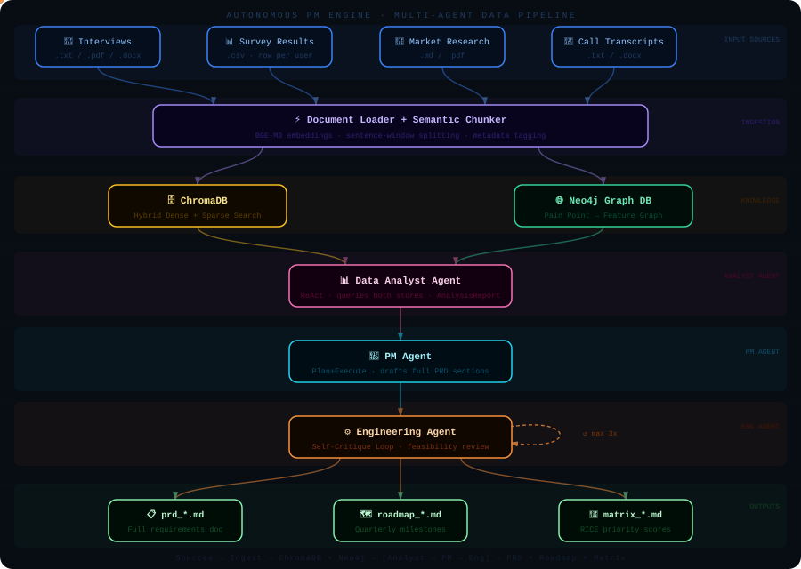

# Autonomous Product Management Engine

> An independent multi-agent prototype that ingests customer feedback, retrieves relevant context, and generates draft Product Requirement Documents (PRDs) and engineering roadmaps for human review.

## Project scope

**Status:** working prototype, with source code and test modules in this repository. It is not presented as a deployed production service.

**Problem:** customer feedback is scattered across documents, making it difficult to turn recurring issues into a reviewable product brief.

**Workflow:** ingest feedback → retrieve context → draft requirements and priorities → run engineering critique → review the artifacts before use.

**Evidence to inspect:** `api.py`, the implementation under `src/`, the test modules, and the sample-output instructions below. Generated priorities and requirements require human validation against the underlying feedback.

**Production work still required:** the current API stores job state in an in-memory dictionary. A production deployment needs persistent job storage, authentication and authorization, upload controls, retention rules, monitoring, and deployment validation. These are requirements to complete, not claimed capabilities.

**Evaluation boundary:** repository test modules demonstrate what can be checked; their presence alone is not a verified passing test run or a measured user outcome. Retrieval quality, source support, and usefulness of generated artifacts need a documented benchmark before operational claims are made.

---

## How It Works
 

 
> **Reading the diagram:** Coloured dots flow live through each connection showing data in motion. Blue dots carry raw documents into the ingestion layer; violet splits them into ChromaDB (dense+sparse search) and Neo4j (entity graph); amber and emerald query results converge into the Data Analyst Agent; pink and cyan carry the structured report through the PM Agent and into the Engineering Agent, where the dashed loop shows the self-critique cycle; orange fans out to the three final output files.
 
---

## Architecture Overview

```
┌─────────────────────────────────────────────────────────────────────┐
│                         INPUT LAYER                                 │
│  Customer Interviews │ Survey CSVs │ Market Research Docs │ PDFs    │
└───────────────────────────────┬─────────────────────────────────────┘
                                │
                                ▼
┌─────────────────────────────────────────────────────────────────────┐
│                     LAYER 5 — KNOWLEDGE LAYER                       │
│                                                                     │
│  ┌──────────────────┐    ┌────────────────────┐    ┌──────────────┐ │
│  │  Document Loader │───▶│  Semantic Chunker   │───▶│  Embeddings  ││
│  │  (multi-format)  │    │  (sentence-window)  │    │  (BGE-M3)    ││
│  └──────────────────┘    └────────────────────┘    └──────┬───────┘ │
│                                                           │         │
│                          ┌─────────────────┐              │         │
│                          │    Graph DB      │◀─── Entity  │         │
│                          │    (Neo4j)       │     Linking │         │
│                          │  Pain→Feature    │             │         │
│                          └─────────────────┘              │         │
│                                                           ▼         │
│                          ┌─────────────────────────────────────────┐│
│                          │        Vector DB (ChromaDB)             │|
│                          │   Hybrid Search: Dense + Sparse (BM25)  ││
│                          └─────────────────────────────────────────┘│
└───────────────────────────────┬─────────────────────────────────────┘
                                │
                                ▼
┌─────────────────────────────────────────────────────────────────────┐
│                   LAYER 4 — ORCHESTRATION LAYER (LangGraph)         │
│                                                                     │
│   INGEST ──▶ EMBED ──▶ EXTRACT_ENTITIES ──▶ ANALYZE ──▶ DRAFT_PRD   │
│                                                              │      │
│   ◀──────────────── REVIEW_PRD (self-critique loop) ◀───────┘       │
│         │                                                           │
│         ▼ (passes gate)                                             │
│       OUTPUT                                                        │
└───────────────────────────────┬─────────────────────────────────────┘
                                │
                                ▼
┌─────────────────────────────────────────────────────────────────────┐
│                       AGENT LAYER (CrewAI)                          │
│                                                                     │
│  ┌─────────────────┐  ┌────────────────┐  ┌─────────────────────┐   │
│  │  Data Analyst   │  │   PM Agent     │  │  Engineering Agent  │   │
│  │  Agent          │  │  Plan+Execute  │  │  ReAct + Self-Crit. │   │
│  │  (trends/stats) │  │  (PRD draft)   │  │  (feasibility gate) │   │
│  └─────────────────┘  └────────────────┘  └─────────────────────┘   │
└───────────────────────────────┬─────────────────────────────────────┘
                                │
                                ▼
┌─────────────────────────────────────────────────────────────────────┐
│                         OUTPUT LAYER                                │
│     PRD Markdown  │  Engineering Roadmap  │  Feature Priority Matrix│
└─────────────────────────────────────────────────────────────────────┘
```

---

## Tech Stack

| Layer | Technology | Purpose |
|---|---|---|
| LLM | OpenAI GPT-4o | Reasoning backbone for all agents |
| Embeddings | `BAAI/bge-m3` (sentence-transformers) | Dense semantic embeddings |
| Vector DB | ChromaDB | Hybrid dense + sparse retrieval |
| Graph DB | Neo4j | Entity linking: pain points to features |
| Agent Framework | CrewAI | Role-based multi-agent execution |
| Orchestration | LangGraph | Stateful, cyclical workflow DAG |
| Document Loading | LangChain community loaders | PDF, DOCX, CSV, TXT ingestion |
| API (optional) | FastAPI | REST interface for pipeline |
| Config | Pydantic Settings | Type-safe environment management |
| Observability | Loguru + Rich | Structured logging and console output |

---

## Prerequisites

- Python 3.11+
- Docker and Docker Compose (for Neo4j + ChromaDB server mode)
- An OpenAI API key (GPT-4o access required)

---

## Quick Start

### 1. Clone and install

```bash
git clone https://github.com/Agent007repo/autonomous-pm-engine.git
cd autonomous-pm-engine

python -m venv .venv
source .venv/bin/activate          # Windows: .venv\Scripts\activate

pip install -r requirements.txt
```

### 2. Configure environment

```bash
cp .env.example .env
# Edit .env and fill in your OpenAI API key and Neo4j credentials
```

### 3. Start infrastructure services

```bash
docker-compose up -d
# Starts Neo4j (bolt://localhost:7687) and waits for readiness
```

### 4. Run the pipeline on sample data

```bash
python main.py --input-dir sample_data/ --output-dir outputs/
```

### 5. View outputs

The pipeline writes three files to `outputs/`:

```
outputs/
├── prd_<timestamp>.md          # Full structured PRD
├── roadmap_<timestamp>.md      # Engineering roadmap (quarters)
└── priority_matrix_<timestamp>.md  # Feature priority matrix (RICE)
```

---

## Running via API

```bash
uvicorn api:app --reload --port 8000
```

Then POST your documents:

```bash
curl -X POST http://localhost:8000/analyze \
  -F "files=@sample_data/customer_interviews.txt" \
  -F "files=@sample_data/survey_results.csv" \
  -F "product_name=MyProduct" \
  -F "product_context=B2B SaaS project management tool"
```

---

## Project Structure

```
autonomous-pm-engine/
├── main.py                        # CLI entry point
├── api.py                         # FastAPI REST interface
├── requirements.txt
├── docker-compose.yml
├── .env.example
├── src/
│   ├── config/
│   │   └── settings.py            # Pydantic settings (all env vars)
│   ├── knowledge/
│   │   ├── document_loader.py     # Multi-format document ingestion
│   │   ├── semantic_chunker.py    # Sentence-window semantic chunking
│   │   ├── vector_store.py        # ChromaDB hybrid search wrapper
│   │   └── graph_store.py         # Neo4j entity-linking operations
│   ├── agents/
│   │   ├── data_analyst_agent.py  # CrewAI: trend analysis
│   │   ├── pm_agent.py            # CrewAI: PRD drafting (plan+execute)
│   │   └── engineering_agent.py   # CrewAI: feasibility + self-critique
│   ├── orchestration/
│   │   ├── state.py               # LangGraph TypedDict state schema
│   │   ├── nodes.py               # Individual graph node functions
│   │   └── workflow.py            # StateGraph assembly + compilation
│   ├── tools/
│   │   ├── search_tools.py        # CrewAI-compatible tools (vector + graph)
│   │   └── output_tools.py        # PRD section writing tools
│   └── output/
│       ├── prd_generator.py       # PRD assembly logic
│       └── templates.py           # Markdown templates
├── sample_data/
│   ├── customer_interviews.txt
│   ├── survey_results.csv
│   └── market_research.md
├── outputs/                       # Generated PRDs land here
├── tests/
│   ├── test_chunker.py
│   ├── test_vector_store.py
│   ├── test_graph_store.py
│   └── test_workflow.py
└── docs/
    ├── architecture.md            # Deep-dive design decisions
    └── extending.md               # How to add new agents/data sources
```

---

## Configuration Reference

Configuration comes from Pydantic settings and `.env`. See `.env.example`. Root Python modules contain the implementation; `src/` modules are compatibility re-exports.

| Variable | Default | Description |
|---|---|---|
| `OPENAI_API_KEY` | required | OpenAI API key |
| `OPENAI_MODEL` | `gpt-4o` | Model used by all agents |
| `NEO4J_URI` | `bolt://localhost:7687` | Neo4j connection URI |
| `NEO4J_USER` | `neo4j` | Neo4j username |
| `NEO4J_PASSWORD` | required | Neo4j password |
| `CHROMA_HOST` | `localhost` | ChromaDB host |
| `CHROMA_PORT` | `8001` | ChromaDB HTTP port |
| `CHROMA_COLLECTION` | `pm_engine` | Collection name |
| `EMBEDDING_MODEL` | `BAAI/bge-m3` | sentence-transformers model |
| `CHUNK_SIZE` | `512` | Approximate token budget (word-count proxy) |
| `CHUNK_OVERLAP` | `0` | Reserved; nonzero overlap is rejected |
| `TOP_K_RETRIEVAL` | `10` | Chunks retrieved per query |
| `MAX_CRITIQUE_ROUNDS` | `3` | Engineering self-critique iterations |
| `LOG_LEVEL` | `INFO` | Loguru log level |

---

## Agent Roles

### Data Analyst Agent
- Queries ChromaDB for top recurring pain-point themes
- Queries Neo4j for feature frequency and co-occurrence graphs
- Outputs a structured `AnalysisReport` with quantified trends

### PM Agent (Plan-and-Execute)
- Receives `AnalysisReport` and creates a step-by-step PRD plan
- Executes each PRD section (Overview, Goals, User Stories, Acceptance Criteria, Non-Goals)
- Uses the vector store as a retrieval tool to ground claims in source data

### Engineering Agent (ReAct + Self-Critique)
- Reads the drafted PRD
- Identifies technical feasibility risks, missing NFRs, and under-specified acceptance criteria
- Reviews the same draft up to `MAX_CRITIQUE_ROUNDS`; it does not automatically revise the PRD
- Appends a "Technical Feasibility Assessment" section to the final PRD

---

## Sample Output Structure (PRD)

```markdown
# PRD: [Feature Name]
**Version:** 1.0 | **Status:** Draft | **Generated:** YYYY-MM-DD

## 1. Executive Summary
## 2. Problem Statement (grounded in customer data)
## 3. Goals and Success Metrics (OKR format)
## 4. User Stories (Gherkin format)
## 5. Acceptance Criteria
## 6. Non-Goals and Out of Scope
## 7. Technical Feasibility Assessment (Engineering Agent)
## 8. Engineering Roadmap (quarterly milestones)
## 9. Feature Priority Matrix (RICE scoring)
## 10. Open Questions and Risks
## 11. Source Evidence (citations from ingested data)
```

---

## Running Tests

```bash
pytest tests/ -v
```

---

## Contributing

See `docs/extending.md` for instructions on adding new:
- Document loaders (e.g., Notion, Jira export)
- Agent roles (e.g., UX Researcher Agent)
- Output formats (e.g., Confluence export, Linear integration)

---

## License

MIT


## Review and validation status

The workflow declares its transient document/chunk state channels and binds dependencies per compiled graph. Separate runs get separate Chroma collections and Neo4j namespaces. Sparse retrieval uses BM25 over stored text; it does not invoke Chroma's default embedding model. Chunking and retrieval share the loaded embedding model. Document identities retain source provenance.

Uploads accept PDF, DOCX, CSV, TXT, and Markdown basenames, reject traversal and duplicate names, and enforce limits while streaming. Defaults are 20 files, 10 MiB per file, and 50 MiB total (`MAX_UPLOAD_FILES`, `MAX_UPLOAD_BYTES`, `MAX_UPLOAD_TOTAL_BYTES`). Each job gets isolated input/output directories and downloads stay inside its output directory. Docker service ports bind to localhost. Failed ingestion prevents output, and an incomplete CLI run exits unsuccessfully.

These controls are not authentication. The API stores jobs in memory and has no ownership authorization, durable queue, global resource quota, or retention cleanup. Do not expose it to untrusted users. Source documents go to the configured OpenAI service for reasoning; local embeddings and stores do not make this a sovereign or fully local system. Prompts treat source text as untrusted, but prompt injection protection is not proven.

```bash
python -m unittest discover -s tests -p test_regressions.py -v
```

The focused regression suite uses actual method definitions with boundary doubles. It checks prompt formatting, source identities, BM25 behavior, retrieval endpoints, chunk constraints, uploads, and state channels. The full pinned dependency installation, original integration suite, real Neo4j/Chroma services, OpenAI calls, and concurrent jobs have not been reproduced during this review. A passing focused suite does not establish an end-to-end working deployment. Full `pytest tests/ -v` remains a required integration check in a configured environment.

Semantic chunk lengths use a word-count token estimate. Oversized sentences are split into fragments with original sentence-span metadata; overlap is disabled. The engineering gate is computed locally from validated numeric scores, and failed gates produce `Needs Review`. It is an automated review of a draft, not approval for product delivery. No sustainable-inference or energy benchmark has been measured.
